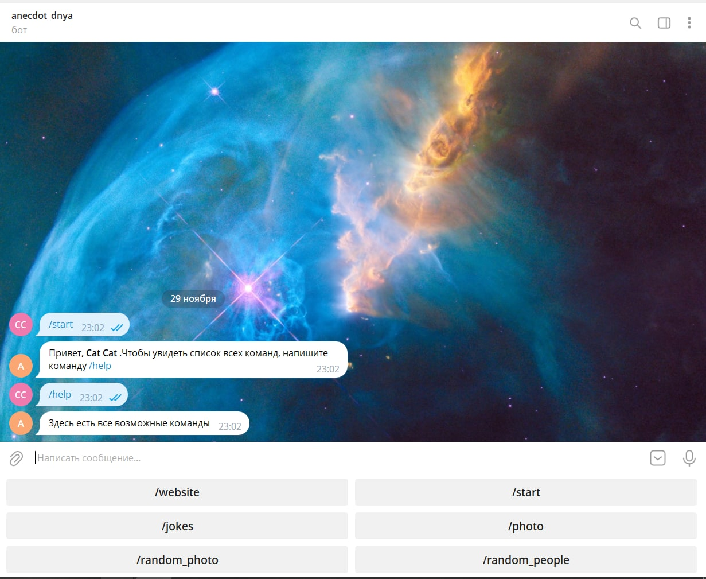
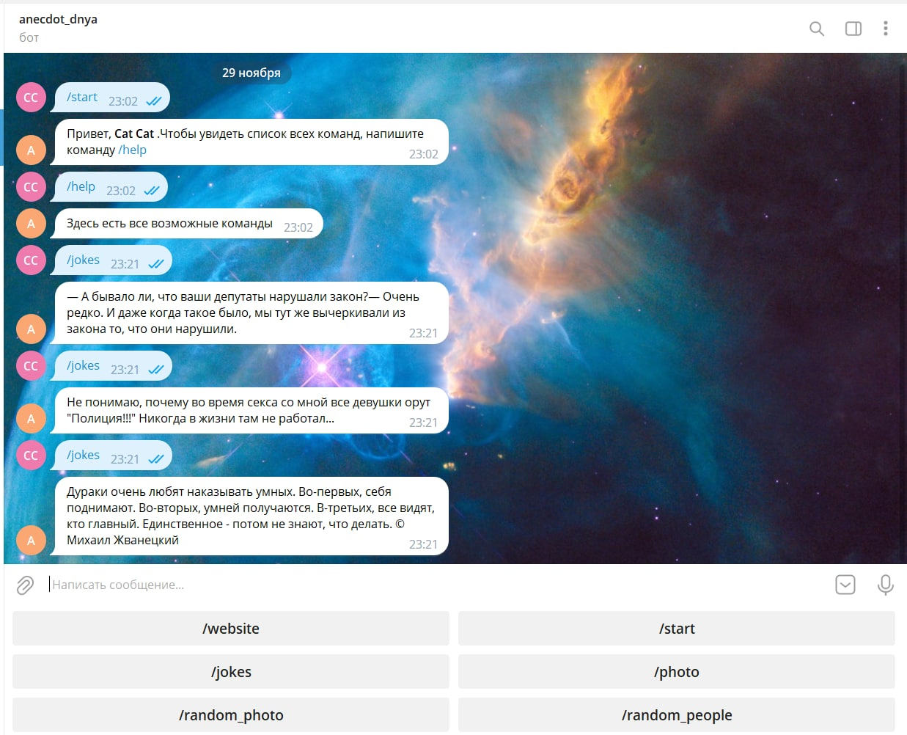
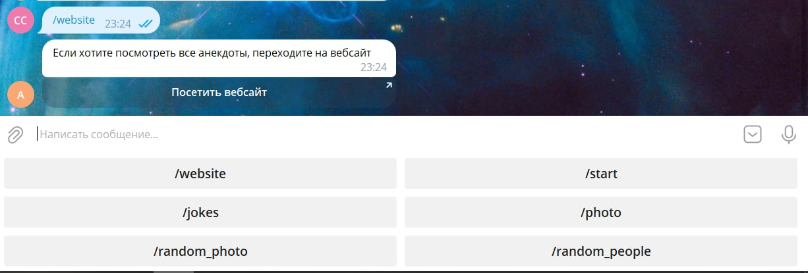
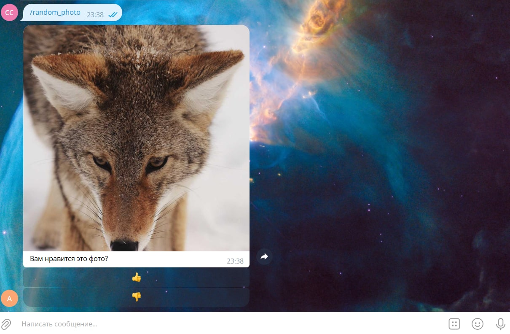
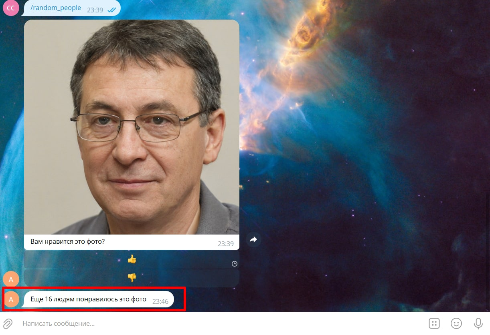
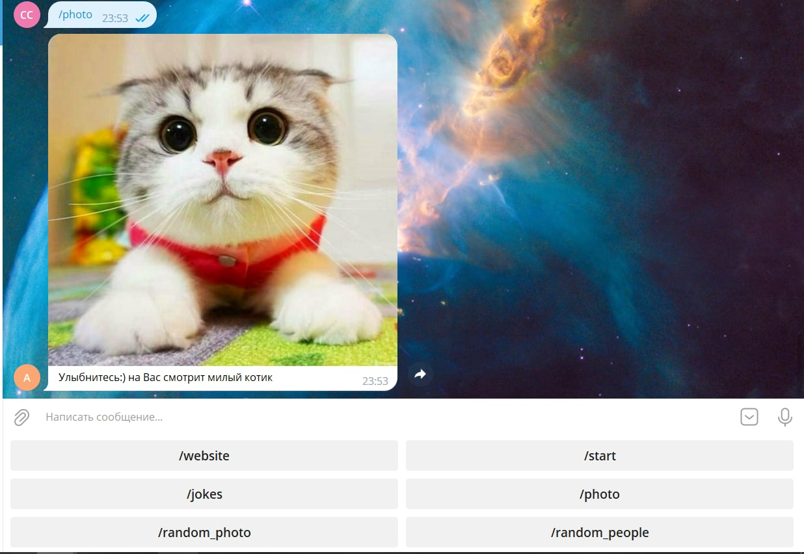

# Телеграмм - бот с использованием библиотеки requests

Данный телеграмм - бот написан с помощью библиотеки **telebot** и носит развлекательный характер. Также были использованы библиотеки:

- **requests** - для управления HTTP - запросами и дальнейшего получения доступа к необходимым нам текстовым данным со страницы;

- **BeatifulSoap4** - для грамотного парсинга html - страницы и вычленения необходимых нам данных с нее.

Ссылка на ТГ - бот : https://t.me/anecdot_dnya_bot

## Функционал бота:

Функционал бота и все возможные команды, предусмотренные в нем, пользователь может увидеть в небольшем нижнем меню. При запуске (командне **/start**) пользователю предлагается отправить команду **/help** и увидеть все возможные команды бота:

Соответственно видно, что после команды **/help** внизу появляется меню в виде кнопок,которые и являются всеми командами в этом боте.

Давайте рассмотрим каждую команду по отдельности.

### Анекдоты

Если пользователь нажимает команду **/jokes**, то ему в ответ приходит любой рандомный анекдот, взятые с сайта https://www.anekdot.ru:

Соответственно, при нажатии команды **/website**, пользователь может перейти на сайт, откуда парсятся анекдоты и посмотреть весь список шуток:

### Оценка случайных фото

При нажатии команд **/random_photo** (рандомные фото природы) и **/random_people** (рандомные фото с людьми) пользователю отправляются фото, взятые с сайтов https://picsum.photos/1200 и https://thispersondoesnotexist.com/image, и бот предлагает оценить эти фото, т.е. поставить лайк или дизлайк:

И после нажатия пользователем лайка или дизлайка ему выводится сообщения от бота с количеством уже поставленных лайков или дизлайков от других пользователей:

### Милое фото котика в конце

Если пользователь нажимает команду **/photo**, то ему просто бот отправляет милую картинку с котиком:

